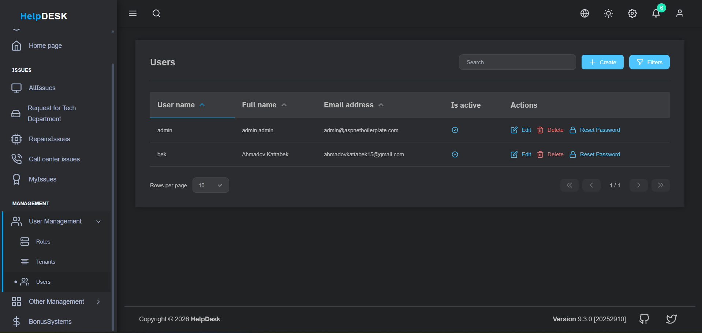
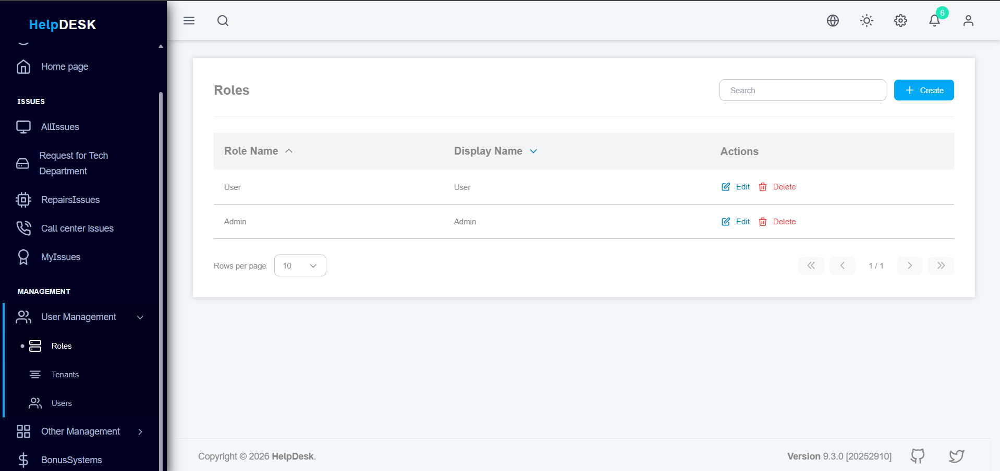
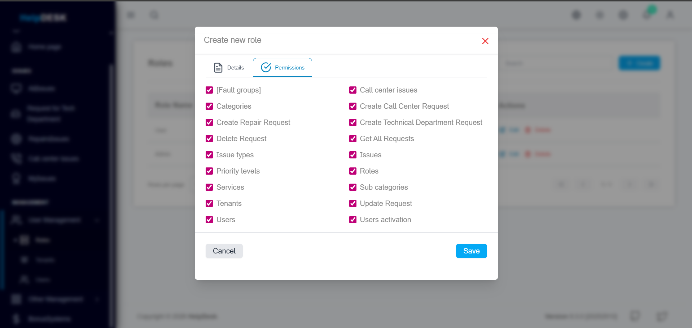
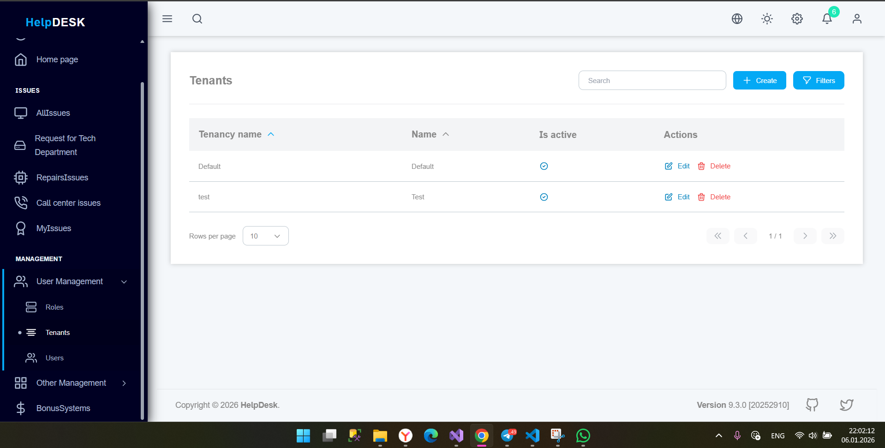
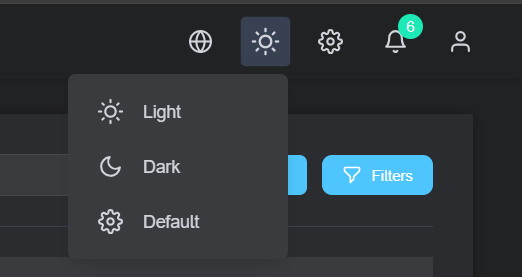
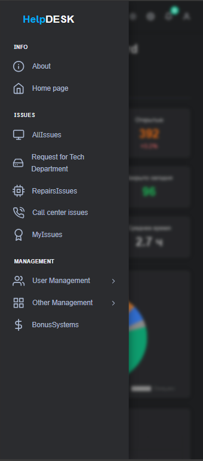

# 🛠 HelpDesk – Enterprise Multi-Tenant Support System

## 📌 Overview

**HelpDesk** is a modern, enterprise-grade, multi-tenant support and ticket management system designed for organizations that require scalability, security, and flexibility. The project was built with real-world business needs in mind and demonstrates strong architectural decisions suitable for large-scale systems.

This repository contains **both Backend (ASP.NET Core)** and **Frontend (Angular)** in a single monorepo structure.

---

## 🎯 Key Goals of the Project

* Build a **production-ready HelpDesk system**
* Support **multiple organizations (multi-tenancy)**
* Provide **role-based and permission-based access control**
* Support **multiple languages and themes**
* Be fully **responsive and mobile-friendly**
* Follow **clean architecture and best practices**

---

## 🧩 Architecture

### 🔹 Backend

* **ASP.NET Core** (Clean Architecture)
* **Entity Framework Core**
* **JWT-based Authentication & Authorization**
* **Role & Permission Management**
* **Multi-Tenant Architecture**
* **Full Audit Logging** (Create / Update / Delete / Login / Actions)
* **RESTful APIs**
* **Dependency Injection & SOLID principles**

### 🔹 Frontend

* **Angular** (modular architecture)
* **Responsive UI (Mobile / Tablet / Desktop)**
* **Multi-language (i18n)**
* **Light & Dark Themes**
* **JWT Token Handling**
* **Role & Permission-based UI rendering**

---

## 🌍 Multi-Tenancy

The system supports multiple tenants (companies/organizations) in a single deployment:

* Each tenant has isolated data
* Tenant-aware authentication
* Role and permission separation per tenant
* Scalable for SaaS deployment

---

## 🔐 Security

* JWT Authentication
* Role-based access control (RBAC)
* Permission-based authorization
* Secure API endpoints
* Audit logs for all critical operations

---

## 🌐 Internationalization & Theming

* Multi-language support
* Easily extendable translation system
* Light / Dark theme switching
* Theme persistence per user

---

## 📱 Responsive Design

* Fully optimized for mobile devices
* Adaptive layouts for tablets and desktops
* Modern UI/UX principles applied

---

## 🧪 Audit & Logging

* Full audit trail for entities
* User action logging
* System event logging
* Designed for compliance and traceability

---

## 📁 Project Structure

```
HelpDesk/
│
├── Backend/
│   └── src/
│       └── HelpDesk.Web.Host/
│
├── Frontend/
│   └── HelpDesk1/   # Angular Application
│
├── screenshots/
│   └── *.png
│
└── README.md
```

---

## 🖼 Screenshots & Feature Walkthrough

Below are real screenshots from the application. Each screenshot is **clearly named** and explained **step by step** to demonstrate real system functionality and user flow.

---

### 1️⃣ Authentication – Login Screen

**File:** `screenshots/login.png`


**Explanation:**

* Entry point of the system for all users
* Secure JWT-based authentication
* Tenant-aware login logic
* Clean, minimal UI focused on usability and security

---

### 2️⃣ Dashboard – System Overview

**File:** `screenshots/dashboard.png`


**Explanation:**

* Central overview of the entire system
* Displays ticket statistics and system status
* Role-based widgets (Admin / Agent / User)
* Quick access to frequently used features

---

### 3️⃣ Ticket Management – Core Business Workflow

**File:** `screenshots/tickets.png`


**Explanation:**

* Create, assign, update, and close support tickets
* Ticket priorities, statuses, and categories
* Permission-based actions per role
* Optimized workflow for real support teams

---

### 4️⃣ User, Role & Permission Management

**File:** `screenshots/users.png`



**Explanation:**

* Manage users within each tenant
* Assign roles and fine-grained permissions
* Enforce security rules across the system
* Enterprise-grade access control design

---

### 5️⃣ Role Management

**File:** `screenshots/roles.png`



**Explanation:**

* Create and manage system roles (Admin, Agent, User, etc.)
* Assign permissions to roles
* Centralized role control per tenant

---

### 6️⃣ Permission Management

**File:** `screenshots/permissions.png`



**Explanation:**

* Fine-grained permission configuration
* Control access to specific actions and features
* Used to enforce security across backend and frontend

---

### 7️⃣ Tenant Management

**File:** `screenshots/tenants.png`



**Explanation:**

* Manage multiple tenants (organizations)
* Isolated data per tenant
* SaaS-ready multi-tenant design

---

### 8️⃣ Theme Switching (Light / Dark)

**File:** `screenshots/theme-switch.png`



**Explanation:**

* Toggle between light and dark themes
* Theme preference saved per user
* Improved accessibility and user experience

---

### 9️⃣ Mobile Responsive View
**File:** `screenshots/mobile.png`


- Fully responsive layout
- Optimized for mobile devices
- Smooth experience across screen sizes

---

### 🔟 Mobile Responsive Menu
**File:** `screenshots/mobile_menu.png`



- Responsive navigation menu
- Touch-friendly UI
- Seamless mobile usability

---

## 🚀 Getting Started

### Prerequisites

* .NET SDK 7+
* Node.js 18+
* Angular CLI
* SQL Server

### Backend Setup

```bash
cd Backend
# configure connection string
# update database
```

### Frontend Setup

```bash
cd Frontend/HelpDesk1
npm install
ng serve
```

---

## 🧠 Why This Project Matters

This project demonstrates:

* Enterprise-level backend architecture
* Secure authentication & authorization
* Scalable multi-tenant design
* Real-world frontend & backend integration
* Production-ready coding standards

It is suitable as:

* A **portfolio project**
* A **real SaaS foundation**
* A **reference architecture** for enterprise systems

---

## 👨‍💻 Author

**Bek**
Full Stack .NET & Angular Developer

---

## 📜 License

This project is licensed for educational and demonstration purposes.

---

⭐ If you find this project valuable, feel free to star the repository!
