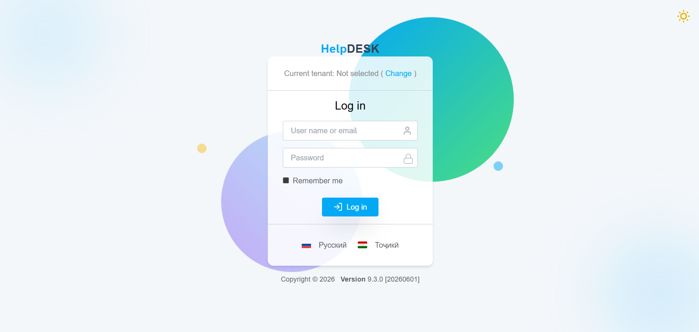
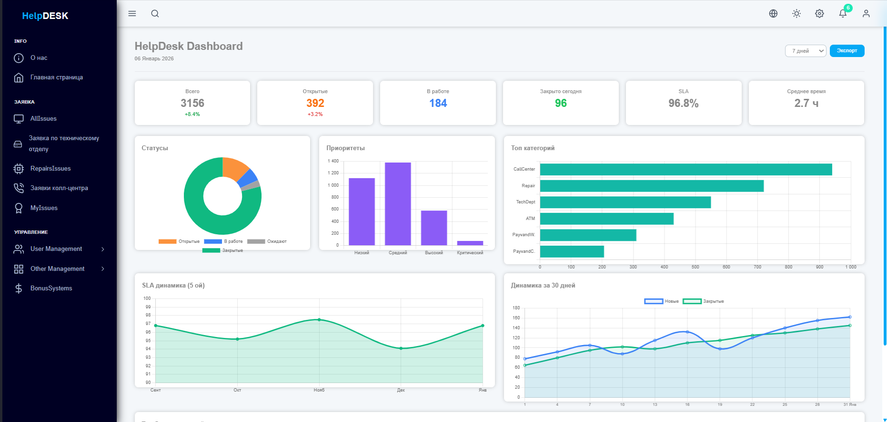
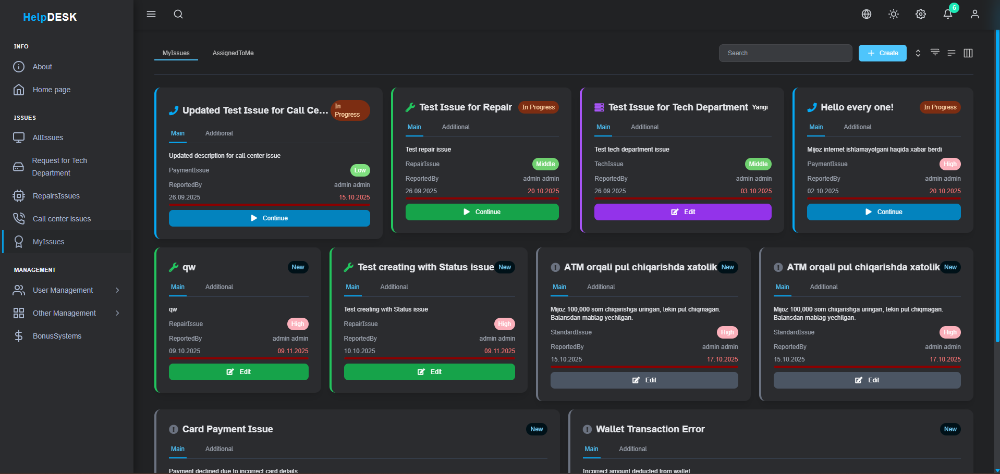
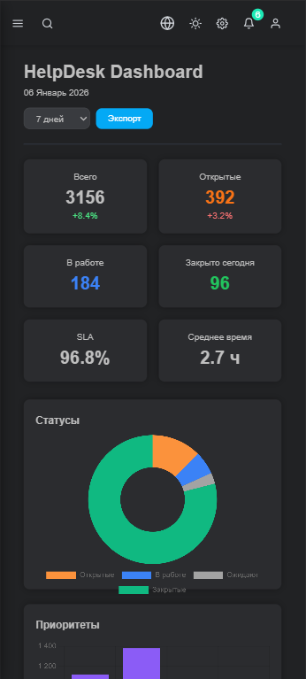

# 🛠 HelpDesk Management System

A modern, enterprise-ready **multi-tenant HelpDesk application** built with **ASP.NET Core** and **Angular**, designed to manage support tickets efficiently across organizations.

---

## 🚀 Key Features

- 🌍 Multi-language support
- 🎨 Light & Dark theme modes
- 🧑‍💼 Role-based and Permission-based access control
- 🏢 Multi-tenant architecture
- 🔐 JWT Authentication & Authorization
- 🧾 Full audit logging
- 📱 Responsive & mobile-friendly UI
- 🗄 Entity Framework Core
- 🔌 RESTful API (ASP.NET Core)
- 🖥 Modern Angular frontend

---

## 🧠 Technology Stack

**Backend**
- ASP.NET Core
- Entity Framework Core
- JWT Authentication

**Frontend**
- Angular
- Tailwind / Modern UI
- Responsive design

**Architecture**
- Multi-tenant
- RESTful API
- RBAC & Permission Control

---

## 📸 Screenshots

### 🔐 Login


### 📊 Dashboard


### 🎫 Ticket Management


### 🌙 Dark Mode


### 📱 Mobile View


---

## ⚙️ Getting Started

### Backend
```bash
cd Backend
dotnet restore
dotnet run
